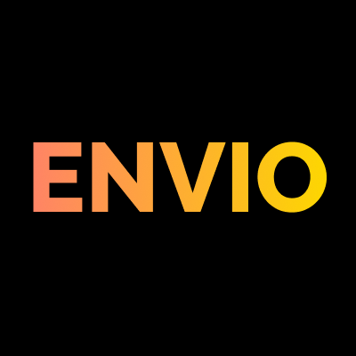

# Envio Brand Kit

Envio is Web3's backend for real-time blockchain data, dev-friendly, speed-optimized, and built by builders, for builders. This brand kit gives you everything you need to represent Envio accurately and consistently across any context.

Whether you're a partner, community contributor, or integration builder, use these assets to keep the brand sharp.

---

## Contents

- [Logo Assets](#logo-assets)
- [Logo Usage](#logo-usage)
- [Colour Palette](#colour-palette)
- [Do's and Don'ts](#dos-and-donts)
- [Contact](#contact)

---

## Logo Assets

All assets are in the repository root. SVG is preferred wherever possible.

| File | Format | Use case |
|---|---|---|
| `envio-logo-primary.svg` / `.png` | SVG, PNG | Default logo, use in most situations |
| `envio-logo-white.svg` / `.png` | SVG, PNG | For dark or coloured backgrounds |
| `envio-logo-1x1-clear.svg` / `.png` | SVG, PNG | Square icon for social avatars, favicons, app icons |
| `envio-logo-1x1-black.png` | PNG | Square icon on light backgrounds |
| `envio-logo-high rez.png` | PNG | High-resolution for print or large-format use |

---

## Logo Usage

### Primary Logo

The primary logo is the default. Use it on light, dark, and neutral backgrounds.

**Clear space:** Maintain clear space around the logo equal to the height of the "E" in Envio on all sides. Don't crowd it.

### White Logo

Use the white logo on dark or coloured backgrounds where the primary logo wouldn't have sufficient contrast.

### Icon (1:1)

Use the square icon variant for social media avatars, favicons, and app icons where a rectangular lockup won't fit.

---

## Colour Palette

### Primary Colours

| Name | Hex | Usage |
|---|---|---|
| Envio Orange | `#FF8267` | Primary brand colour for CTAs, highlights, accents |
| Envio Black | `#0F0F0F` | Primary text, backgrounds, dark UI |

Use primary colours for the majority of brand design elements. Envio Orange should be used purposefully, as an accent or highlight, not a fill-all.

---

## Do's and Don'ts

**Do:**
- Use the SVG logo whenever possible for sharpness at any size
- Maintain the required clear space around the logo
- Use the white logo on dark backgrounds
- Use the square icon for avatars and favicons

**Don't:**
- Stretch, skew, or rotate the logo
- Recolour the logo outside of the approved variants
- Place the primary logo on a busy or low-contrast background
- Add drop shadows, outlines, or other effects to the logo
- Use the logo smaller than 24px in height in digital contexts

---

## Contact

Need something not covered here, a different file format, a specific size, or brand guidance for a particular use case?

Reach us on [Discord](https://discord.gg/envio)
test